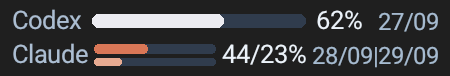
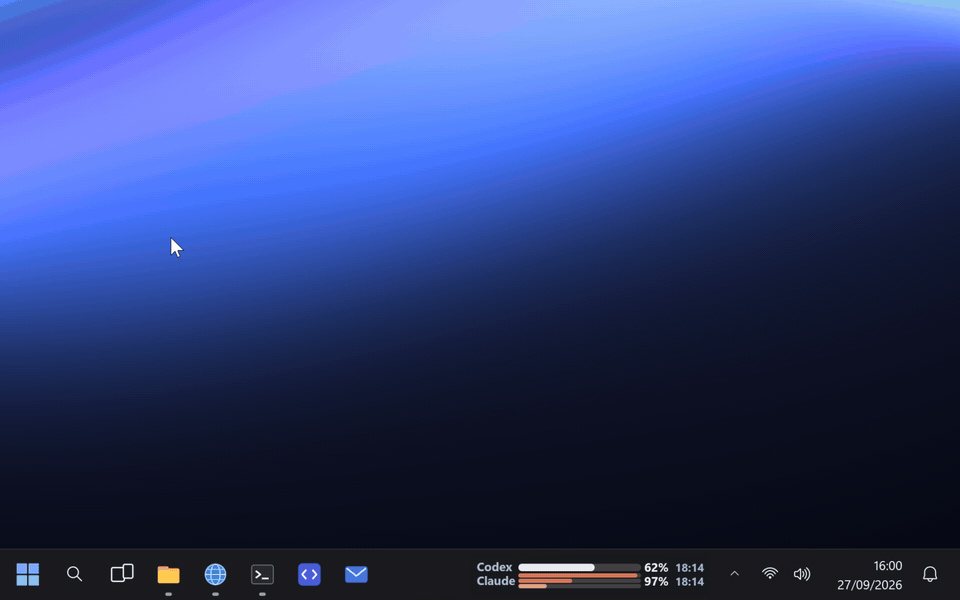
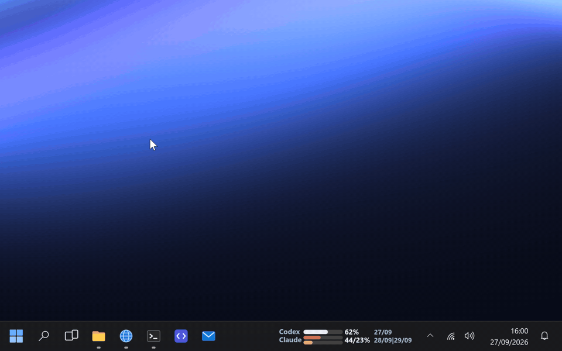
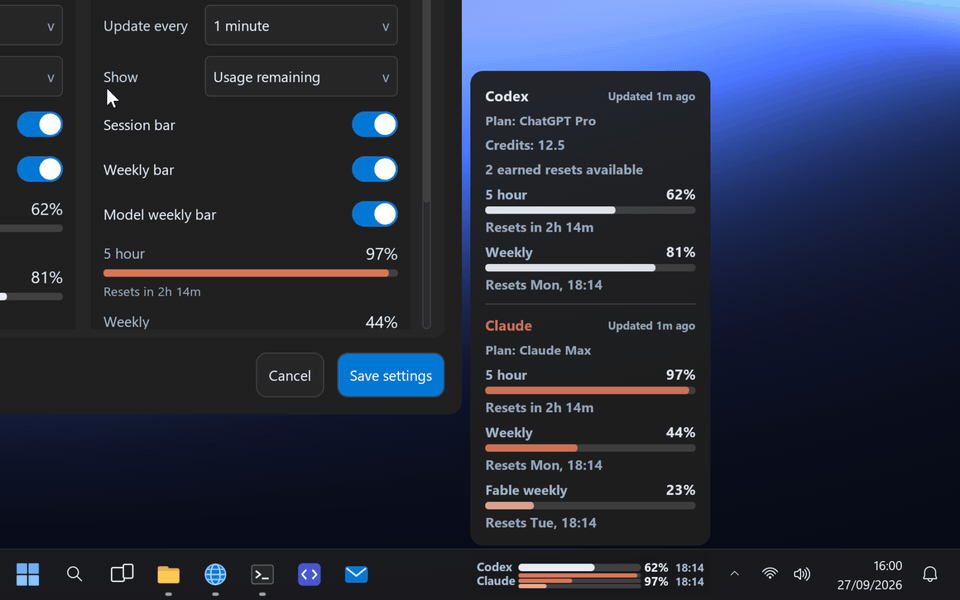
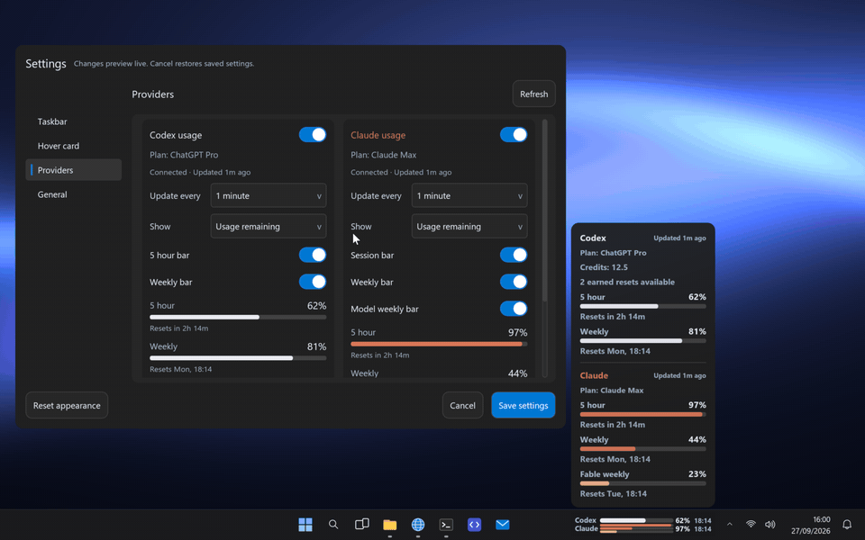
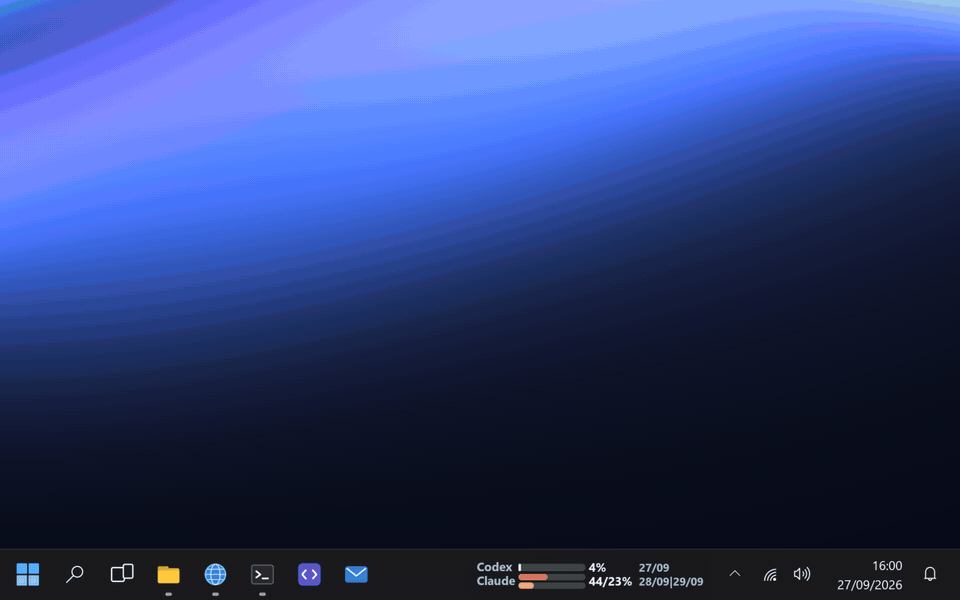

# BarTab

I kept running out of Codex and Claude allowance at the worst possible moment, so I built a little widget that lives in the Windows 11 taskbar and tells me how much I've got left. It runs on Linux too, where it floats above your windows or docks into a panel.



There's no setup to speak of. If the Codex or Claude CLI is installed and you're signed in, BarTab asks it for your usage and that's it. You don't need API keys or to connect any accounts.

## What it does

Each provider gets one row in a gap on the taskbar: a bar, the percentage you have left, and when it resets. For Codex that's whichever window is lowest. For Claude it's the overall weekly allowance and the Fable one, side by side.

Hover over it and a card slides up out of the taskbar with the full picture: every allowance window and when it resets, your plan, and for Codex your credits and earned resets ([MP4](docs/media/hover.mp4)).



Click it to open Settings. Changes show up on the taskbar and the hover card as you make them (the card stays pinned next to the window so you can see it). Save if you like it, Cancel if you don't ([MP4](docs/media/settings.mp4)).



You don't have to use both providers. With both on you get two rows. With just Claude, it splits into General and Fable. With just Codex, you see the 5-hour and weekly windows ([MP4](docs/media/modes.mp4)).



Turn providers on and off and set how often each one updates on the Providers page ([MP4](docs/media/providers.mp4)):



Right-click the widget or the tray icon for Settings, Start at boot, and Quit ([MP4](docs/media/menu.mp4)).


And when an allowance resets, the bar fills back up and you get some confetti. You earned it ([MP4](docs/media/reset.mp4)).



A few other things worth knowing:

- It picks up your light/dark mode, accent colour and UI font, and changes along with them. On Linux it uses your desktop's theme, accent and font.
- You can put it anywhere along the taskbar. It looks for free space next to your taskbar buttons and won't cover them.
- If you have more than one monitor, you can have a widget on each taskbar.
- If you've turned animations off in Windows, it turns them off too.
- It works from the keyboard: Tab moves between controls, the arrow keys move sliders, Enter activates and Escape closes.

## Getting started

You'll need the [Codex](https://github.com/openai/codex) CLI, the [Claude Code](https://docs.anthropic.com/en/docs/claude-code) CLI, or both, installed and signed in. BarTab looks for them on your PATH, in npm, Scoop, WinGet and Cargo installs, and inside the VS Code, Cursor and Windsurf extensions, so it'll most likely find them without help.

### Windows 11

You'll need Visual Studio 2022 (with the "Desktop development with C++" workload) and CMake 3.22 or newer.

```powershell
git clone --recursive https://github.com/AlessandroAU/BarTab.git
cd BarTab
.\build.bat   # build, test and install to bin\
.\run.bat     # start it
```

You end up with one self-contained `bin\BarTab.exe`.

### Linux

It runs on X11, and on Wayland desktops (GNOME, KDE and so on) through XWayland. On Debian or Ubuntu:

```sh
sudo apt install build-essential cmake ninja-build libx11-dev libxext-dev libxrandr-dev libxinerama-dev \
    libxcursor-dev libxi-dev libgl-dev libfontconfig-dev libglib2.0-dev xvfb
git clone --recursive https://github.com/AlessandroAU/BarTab.git
cd BarTab
./build.sh && ./run.sh
```

Linux doesn't have a taskbar to sit in, so the widget floats. Drag it wherever you want, or drop it onto a top or bottom panel and it'll dock there. Right-click for the menu.

## Settings

| Page | What's in it |
| --- | --- |
| **Taskbar** | Text size, bold text, show or hide reset dates, widget width, position on the taskbar, every monitor, bar thickness |
| **Hover card** | Turn the card on or off, text size, bold text, opacity |
| **Providers** | Turn Codex and Claude on or off, update interval (15 seconds to 15 minutes), usage remaining or used, which of each provider's bars the taskbar shows, connection details |
| **General** | Bold text in Settings, 24-hour or 12-hour time, update checks and automatic installs, reset all settings |

Settings live in `%LOCALAPPDATA%\BarTab\settings.ini` (`~/.config/BarTab/` on Linux). If something gets messed up, start it with `run.bat --reset` or `./run.sh --reset` and you're back to the defaults.

BarTab used to be called UsageTracker. If you had that installed, the first time BarTab starts it moves your old settings over and updates the start-at-login entry to point at BarTab.

## Privacy

BarTab asks your installed CLIs for their usage numbers, and they fetch those from their own services using your existing sign-in. BarTab doesn't read or store your credentials, and it only keeps the numbers in memory.

The only time BarTab goes online itself is to look for updates. Once a day it asks GitHub for the latest BarTab release; the request carries nothing but BarTab's version. When there's a newer one you get a notification and an **Update to version ...** entry in the right-click menu. Installing downloads the new executable from the GitHub release, checks its signature, swaps it in and restarts BarTab. If you'd rather it did that on its own, switch on **Install updates automatically** in General settings; if you'd rather it never went online, switch off **Check for updates**.

## Limitations

- On Windows it needs Windows 11 with the taskbar along the top or bottom of the screen. There's no macOS version yet.
- The percentages are based on what each provider reports, so don't treat them as an exact token count.
- I checked Claude's usage reporting against Claude Code 2.1.269. Anthropic could change it at any time.

## Development

[docs/development.md](docs/development.md) covers the architecture, the tests, the mock-provider debug build, and how the screenshots and clips in this README are made.
