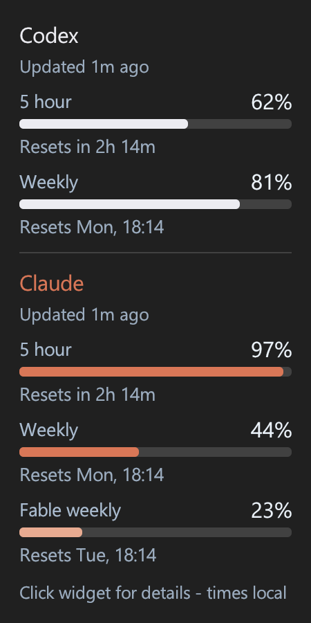
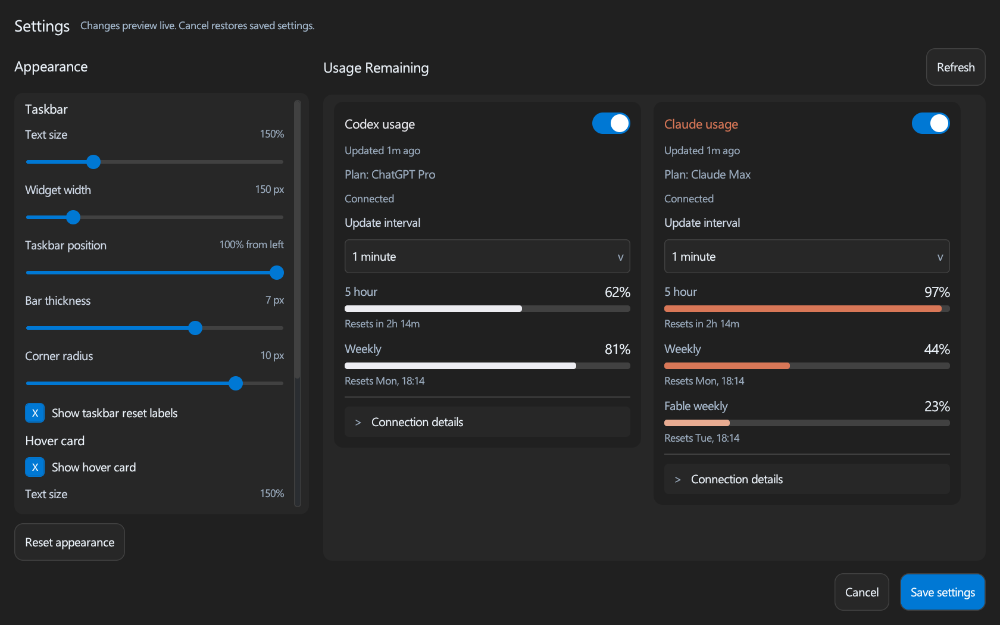
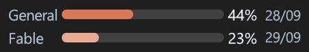

# UsageTracker

A desktop widget that shows how much **Codex** and **Claude** allowance you have left. On Windows 11 it sits in the taskbar; on Linux it floats above your windows wherever you drag it.

It reads usage from the Codex and Claude CLIs you already have installed and signed in, and draws a transparent chart directly in the taskbar (Windows) or in a small always-on-top strip (Linux). Built with C++20, [Clay](https://github.com/nicbarker/clay), [clay-widgets](https://github.com/AlessandroAU/clay-widgets) and raylib.


Hover for a compact card with every reported allowance window and its reset countdown or local reset time:



Click the widget, or the tray icon, for settings and full usage detail:



## Build and run

### Windows

Requires Visual Studio 2022 (Desktop development with C++), a Windows SDK, and CMake 3.22+. Clone with `git clone --recursive`, or run `git submodule update --init --recursive` in an existing checkout: clay-widgets is a git submodule and brings the Clay, raylib and FreeType revisions it is tested against. Once fetched, builds need no network access. At runtime you need Windows system DLLs and an OpenGL 3.3-capable driver — no .NET and no Visual C++ redistributable, since the MSVC runtime and all libraries are linked statically.

```powershell
.\build.bat   # configure, compile, run the tests, install to bin\
.\run.bat     # start the installed build
```

Both scripts stop any running instance first. Windows Release builds optimize for size, enable link-time optimization across the app and static libraries, remove unused code/data, fold identical sections, and omit debug symbols. Debug builds retain their normal debugging settings. LTO can be disabled when configuring with `-DUSAGETRACKER_ENABLE_LTO=OFF`. The taskbar widget, the hover card and the settings window each have a **Bold text** switch, which asks Windows for the UI font family's bold face; a family without a real bold face is left alone rather than smeared.

Equivalent CMake commands:

```powershell
cmake -S . -B build -G "Visual Studio 17 2022" -A x64
cmake --build build --config Release
ctest --test-dir build -C Release --output-on-failure
cmake --install build --config Release --prefix bin
```

Live usage needs a separately installed, signed-in Codex and/or Claude CLI.

### Linux

Requires GCC 11+ or Clang 14+, CMake 3.22+, and the X11, fontconfig and (optionally) GIO development files. On Debian or Ubuntu:

```sh
sudo apt install build-essential cmake ninja-build libx11-dev libxext-dev libxrandr-dev libxinerama-dev \
    libxcursor-dev libxi-dev libgl-dev libfontconfig-dev libglib2.0-dev xvfb
git submodule update --init --recursive
./build.sh   # configure, compile, run the tests, install to bin/
./run.sh     # start the installed build
```

The Linux host is an X11 program. On Wayland desktops (GNOME, KDE and others) it runs through XWayland, which every mainstream desktop ships: plain Wayland does not let an application place its own windows or keep them above others. Without GIO the app still runs, but keeps a dark theme and fontconfig's default sans-serif instead of following the desktop. `xvfb` is only needed to run the X11 smoke test headlessly in `ctest`.

### macOS

The core, layouts, renderer, host services and their tests are written to build on macOS, but the menu-bar host does not exist yet and nothing has been built or run on a Mac.

## Using it

On Linux the widget floats instead of sitting in a taskbar: drag it anywhere and it remembers the spot (in `~/.config/UsageTracker/widget.ini`). Drop it onto a top or bottom panel and it docks there at the panel's height; elsewhere **Widget height** sets its height. It stays above other windows and on every workspace, and never takes focus. It first appears docked in the top panel, a third of the way in from the right edge. There is no tray icon; right-click the widget for the same menu as on Windows, where **Start at login** writes an XDG autostart entry. Everything else below applies to both.

- **Click** the widget — anywhere in its rectangle, including the transparent gaps — or the tray icon to open the settings and usage panel.
- **Hover** it for the usage card. The card never takes focus, stays open while the pointer is over it, and closes after a short grace period when you leave. Click the taskbar widget to open details. While Settings is open the card stays pinned above the widget so hover changes preview live; the settings window moves aside if the two would overlap.
- **Right-click** the widget or tray icon for Settings, **Start at boot**, and Quit. The menu is drawn with clay-widgets like the rest of the UI, follows the light/dark theme and accent, and works from the keyboard (arrows, Enter, Escape); a click elsewhere dismisses it. Start at boot registers the current executable path under `HKCU\Software\Microsoft\Windows\CurrentVersion\Run`; move the EXE and you need to toggle it off and on again.
- **Keyboard**: Tab / Shift+Tab moves focus, arrows adjust sliders, Enter activates, Escape closes.

Settings has two independently scrolling panels — **Appearance** and **Providers** — with grouped Taskbar and Hover card controls, each with its own text size. Reset appearance stays below Appearance, Refresh sits beside Usage Remaining, and Save/Cancel stay in the footer. Changes preview live; **Save settings** writes `%LOCALAPPDATA%\UsageTracker\settings.ini`, and Cancel, Escape or closing the window restores what was saved.

### Appearance

| Setting | Range | Default |
| --- | --- | --- |
| Taskbar text size | 65–200% in 5% steps | 100% |
| Widget width | 100–400 px | 225 px |
| Taskbar position (Windows) | 0–100% from left | 100% |
| Show on every monitor (Windows) | on / off | off |
| Bar thickness | 3–9 px | 7 px |
| Corner radius | 0–12 px | 10 px |
| Hover card | on / off, 240–600 px wide | on, 360 px |
| Hover text size | 65–200% in 5% steps | 100% |
| Hover opacity | 50–100% | 95% |

On Linux, colors and the UI font follow the desktop instead: light/dark and the accent color from the XDG desktop portal (GNOME, KDE and others), falling back to GNOME's settings, reduced motion from GNOME's animation switch, and the UI font through fontconfig. Variable UI fonts such as GNOME's Cantarell and Adwaita Sans ship their bold as a named instance of one file; fontconfig's face index selects it, so bold text uses the family's real bold.

Colors and the UI font follow Windows automatically. The application uses Windows app light/dark mode and accent color; the taskbar follows the separate Windows system mode. The font comes from the Windows UI message-font configuration and updates when Windows broadcasts a settings change. Provider colors stay distinct. Older saved Font, Theme, Accent, HoverWidth, and HoverDelay keys are ignored. Text size remains adjustable. Taskbar and hover text default to bold, the settings window to regular.

Text sizes are relative: 100% draws the taskbar text at 1.5× and the hover card at 1.3× the layouts' base font sizes. Settings files from before this scale saved absolute `TextPercent` and `HoverTextPercent` values; they load converted, so the old 150% taskbar and 130% hover sizes both become 100%, and files older still, with only `TextPercent`, use it for both.

Dimensions are logical pixels, before DPI scaling. Widget width is the widget's real width: text size never changes it, and the bars take whatever room the labels leave, so very large text in a narrow widget squeezes the bars away rather than shrinking the text. Compact spacing lets two rows stay stacked up to 120%; larger text uses side-by-side rows to fit the taskbar height. When a free taskbar gap is narrower than the widget, it narrows down to the 100 px minimum, tightening padding and gaps as it shrinks so the bars keep as much length as possible, and hides only when even that does not fit; the full width returns when space becomes available. The hover card keeps its own text size regardless. **Show on every monitor** adds a widget to each other monitor's taskbar (`Shell_SecondaryTrayWnd`), placed by the same width and position rules at that monitor's DPI; the hover card, settings window and reset confetti open from whichever widget the pointer last used, and a widget is removed when its monitor goes away. **Reset appearance to defaults** leaves provider settings alone.

To start over, **Settings → General → Reset all settings** restores every setting, providers included, and on Linux the widget's place; like any change it previews, and Cancel undoes it. If the widget cannot be reached, start the app with `--reset` (`./run.sh --reset` or `run.bat --reset`), which deletes the saved settings - and on Linux the widget position - before starting. Neither touches Start at login/boot.

**Taskbar position** slides the widget along the taskbar: 0% is hard left, 50% centred, 100% hard right. The slider names the spot you want, and the widget takes the closest one it can actually reach — it lands in whichever run of free space gets nearest, so it can sit up against a taskbar button but never underneath one. Free space is recomputed as buttons come and go, so this is a preference rather than a fixed coordinate: on a busy taskbar only one gap may be wide enough, and every position resolves to it.

### Providers

Codex and Claude are always listed, including ones that are disabled or not installed. Each card shows an enable switch, connection status, plan, update age, and every reported usage window with its reset time. Connection details expands to show the executable path and exact last update; errors stay visible.

Each provider has its own enable toggle and update interval (15 s, 30 s, or 1, 2, 5, 10, 15 minutes; 1 minute by default). Disabling one stops its polling but keeps its last readings inspectable. **Refresh usage and detection** rechecks installations and refreshes enabled providers immediately.

### What the taskbar row shows

The taskbar has room for less than the hover card, so it summarises. Codex shows its lowest remaining allowance. When both providers are active and Claude reports both Weekly and Fable weekly, Claude's row splits into two stacked tracks, each a pixel thinner than a full bar and capped to the row's label height — overall weekly above Fable weekly — with percentages and reset dates in the same order (`44 / 23%`). With only Claude enabled, **General** and **Fable** get separate rows:



When Codex alone reports both 5-hour and weekly windows, the widget shows two labeled bars with aligned percentages. Reset descriptions appear beside the rows when space permits; otherwise they remain in the hover card. With only one reported window, the single bar keeps a descriptive reset line underneath, such as `Weekly, Resets in 2h 14m` or `Weekly, Resets Mon, 18:14`, matching the hover card. Other taskbar reset times appear as `DD/MM HH:MM`, shortened to `DD/MM` on the paired row and at widths under 208 px; exact times stay in the hover card. `?` means unavailable. A failed refresh marks retained readings stale rather than inventing numbers.

The hover card also shows each reported plan and, for Codex, credit balance/status and earned reset count when available. Missing account metadata is omitted. Settings also offers 24-hour or 12-hour (AM/PM) clock formatting for reset and update times; relative countdowns stay unchanged.

## How it works

Raylib owns a single hidden OpenGL context and draws Clay commands into cached offscreen textures; Windows then presents those pixels in native windows. GDI only blits. The tray icon and its tooltip stay native OS surfaces; the context menu is a Clay surface (`Surface::Menu`) that both hosts show in a popup at the pointer, sized to the menu's panel.

There is **no game loop**. Redraws happen on input, value changes, DPI or geometry changes, plus once a minute while the hover card is visible to update countdowns. The settings and usage window is the one animated surface: hover fades, toggle knobs and wheel momentum ease, so each input starts a 60 Hz frame loop that stops half a second after the last input, once every transition has settled. It follows the Windows **Animation effects** accessibility switch, and the taskbar widget and hover card stay static. An unchanged placement tick does not repaint, and the hidden popup has no timer. The tradeoff is that each redraw copies pixels from GPU to CPU; for surfaces this small that is an integration choice, not a measured battery win.

On Linux the same renderer feeds X11 windows with 32-bit ARGB visuals, which take its premultiplied pixels unchanged. The widget is a managed utility window marked above, sticky and out of the taskbar; the hover card is override-redirect so it sits exactly beside the widget; the confetti overlay has an empty input shape so clicks fall through; Settings is an undecorated normal window whose top strip moves it through the window manager. Rounded corners, the card's fade and its grow-in are applied to the pixels in software (`src/ui/pixels.*`), since X11 has no layered-window equivalent. The host waits in `poll()` on the X connection with the same no-game-loop rules: a half-second tick for readings and settings, and 60 Hz frames only while something animates.

The taskbar bitmap uses a background alpha of 1/255, so it looks transparent but keeps a full rectangular click target. A worker thread finds unoccupied taskbar space via UI Automation; the widget hides when no gap fits and is recreated if its parent disappears. There is no reserved taskbar space, so a newly appearing button can overlap briefly between snapshots.

### Layout

| Location | Responsibility |
| --- | --- |
| `src/core/` | Portable usage state, Codex/Claude parsing, preferences, free-space algorithm. |
| `src/ui/views.*` | Portable Clay layouts and clay-widgets controls, one focus context per surface; `HostFeatures` tells them what the host can do. |
| `src/ui/pixels.*` | Portable software effects on rendered pixels: rounded corners, fading, backdrop, row shifting. |
| `src/ui/raylib_renderer.*` | Clay commands to offscreen textures, font cache, premultiplied BGRA output. Every platform. |
| `src/host/` | Services every desktop host shares: provider polling (`ProviderSession`), CLI discovery, the settings file, the log, and the interfaces each OS implements (`platform.hpp`, `process_transport.hpp`, `startup.hpp`). |
| `src/windows/` | The Win32 host (taskbar placement, layered windows, tray, popups) and the Windows implementations of the host interfaces. |
| `src/posix/` | Process transport (process groups, `posix_spawn`) and CLI search locations for Linux and macOS. |
| `src/linux/` | The X11 host (`x11.*` wraps Xlib, `app.*` the widget, card, settings and confetti) and Linux platform services: portal/GSettings appearance, fontconfig, XDG paths and autostart. |
| `src/macos/` | Platform services for macOS (paths, system font, LaunchAgent); no desktop host yet. |
| `src/tools/screenshots.cpp` | Renders the README images offscreen from fixed data. |
| `vendor/` | Pinned dependencies, embedded font, licenses, compatibility patch. |
| `tests/` | Core, UI interaction, and library linkage tests. |

Settings file I/O lives in `src/windows/settings_store.*`; the portable `SettingsEdit` owns the cancel snapshot. The Windows host applies previews and commits an edit only after saving succeeds. Preference limits are shared by normalization and UI controls.

Keep portable state in `src/core`, layouts in `src/ui`, services any host needs in `src/host`, and OS integration in `src/windows`, `src/posix`, `src/linux` or `src/macos`. CMake builds these as layers (`usage_core`, `usage_ui`, `usage_renderer`, `usage_host`, then one app per platform), and each layer only depends on the ones before it. The application owns its renderer and views for their whole lifetime, and the renderer must outlive the views.

## Providers and detection

On Linux and macOS, detection checks the same overrides, then PATH, `~/.local/bin`, `~/.claude/local`, `~/.npm-global/bin`, Bun, Volta, Cargo, `/usr/local/bin` and `/opt/homebrew/bin`; then npm packages under each of those prefixes and nvm's Node versions, including npm's per-platform binary packages; then VS Code, Insiders, VS Code OSS and remote-server, Cursor, Windsurf and Flatpak extension folders. Bundles built for another OS or CPU are skipped, and a match must be executable.

On Windows, detection checks the `USAGETRACKER_CODEX` / `USAGETRACKER_CLAUDE` overrides first, then PATH, `.local/bin`, `.cargo/bin`, Scoop, WinGet, and native binaries inside npm packages (including custom prefixes and Node/Volta locations). It also searches OpenAI/Anthropic extensions in VS Code, Insiders, VS Code OSS, Cursor and Windsurf, plus the `VSCODE_EXTENSIONS*` and `VSCODE_PORTABLE` locations. Searches are bounded, skip inaccessible folders, and ignore ARM64 bundles in this x64 build. Only native `.exe` helpers are launched. An invalid override reports an error rather than silently picking something else.

Detection repeats at each provider's interval, when Settings opens, and on manual refresh, so installing a provider recovers without a restart.

Provider protocol messages live in `src/core/provider_protocol.*` and are tested offline. The process transport (`src/windows/process_transport.cpp` with a job object, `src/posix/process_transport.cpp` with a process group) owns the process tree, pipes, line framing, timeout, and cancellation checks. `locations.cpp` in each platform folder builds search locations; `src/host/providers.*` schedules polling and publishes readings.

For usage, a background worker starts a hidden `codex app-server --listen stdio://`, completes the initialize handshake, calls `account/rateLimits/read`, and closes the managed process tree. Claude has an independent worker using the headless `initialize` / `get_usage` control protocol in safe mode, with no session persistence and no model prompt. Requests time out after 20 seconds. The widget never reads or stores credentials — each CLI handles its own authentication.

Remaining percentage is derived from used percentage; it is not an exact token budget. Missing reset times show as unavailable, and last-good values are kept in memory only. Claude's control protocol was verified against version 2.1.269 and may change.

## Testing

Application C++ sources and tests use the root `.clang-format` configuration
(clang-format 18; `pip install clang-format==18.1.8` gets that exact version anywhere). To format them from PowerShell:

```powershell
$sources = Get-ChildItem src,tests -Recurse -File -Include *.cpp,*.hpp
clang-format -i ($sources.FullName)
```

Keep vendored dependencies out of formatting passes.

```powershell
ctest --test-dir build -C Release --output-on-failure
```

Fourteen suites run on every platform. They cover provider protocols, mock provider scenarios, process transport (framing, argument quoting, timeouts, tree cleanup), settings persistence and cancellation, CLI discovery, start at login in an isolated location, the provider session and pixel effects, placement, allowance limits, Clay layouts including each host's settings features, pointer dragging, focus, keyboard navigation, library linkage, and the upstream clay-widgets suite (566 checks). Linux adds `linux_smoke` when `xvfb-run` is installed. Checks stay active in Release builds.

On Linux, `./UsageTracker --smoke-test` is the X11 counterpart of the Windows smoke test below. It uses demo data, isolated `smoke-settings.ini` and `smoke-widget.ini` files beside the executable, and its own instance lock. It checks the widget, hover card open/close, click and settings, the live preview and Escape cancel, saving, position persistence and confetti. It writes `smoke-test.txt` and exits 0 on success. `ctest` runs it under Xvfb.

A live desktop smoke test exercises the real taskbar, hit detection, native mouse messages routed into Clay, and settings save/cancel. Run it unlocked with no other instance:

```powershell
$smoke = Start-Process .\bin\UsageTracker.exe -ArgumentList '--smoke-test' -Wait -PassThru
$smoke.ExitCode   # 0 success, 1 failure, 2 another instance running
Get-Content .\bin\smoke-test.txt
```

It uses an isolated `smoke-settings.ini`, stays offline, writes diagnostic bitmaps beside the executable, and exits after about eight seconds. It does not restart Explorer or change Windows settings. `--live-smoke-test` is the online variant against real signed-in providers, reporting to `bin/codex-live-test.txt`.

Logs: `%LOCALAPPDATA%\UsageTracker\prototype.log` on Windows and `~/.local/state/UsageTracker/usagetracker.log` on Linux, capped at 1 MB (the oldest half is dropped when it fills). Linux settings live in `~/.config/UsageTracker/`. Tested on Windows 11 build 26200 at 100% scaling with MSVC 19.44, and on Debian 13 (GCC 14, GNOME 48 on Wayland through XWayland) for the Linux host.

### Mock providers (debug build)

`bin\UsageTrackerDebug.exe` is the same app with the Codex and Claude CLIs replaced by mock endpoints, for trying every provider combination without the accounts to match. It opens a **Mock providers** window (reopen it from the tray menu) with:

- **Scenario** presets: both providers, Codex only with 5 hour + weekly, weekly only or 5 hour only, Claude only with or without a model window, near the limits, a login error, a malformed reply, both connecting, and nothing installed.
- Per provider: its state (Ready, Not installed, Login error, Connecting, Malformed reply), the plan, and for each allowance whether it is reported, how much is used, and when it resets. Codex also has credits and earned resets; Claude has the model-scoped window's name.

Every change applies immediately. The mocks answer each CLI's real wire protocol, so readings still pass through the protocol handling, the parsers, the reader threads and their error handling. The debug build takes its own instance lock and saves to `debug-settings.ini`, so it can run beside the installed copy without touching its settings; the two widgets keep out of each other's way on the taskbar.

On Linux, `bin/UsageTrackerDebug` uses the same mock endpoints; there is no control panel; the context menu's **Next mock scenario**, or a middle-click on the widget, moves on to the next one.

The `mock_providers` test renders every preset on the taskbar, hover card, details and settings surfaces and checks each lays out as expected; a new preset must be given an expected layout there.

### Regenerating the screenshots

The README images are rendered offscreen from fixed demo data — no taskbar, no visible window, no provider processes — so they stay in sync with the UI:

```powershell
cmake --build build --config Release --target docs-screenshots
```

## Remaining scope

Additional service connections, a macOS menu-bar host, native Wayland layer-shell hosting (KDE, Sway, Hyprland) and accessibility-provider integration are future work. On Linux, HiDPI scaling follows `Xft.dpi` (or `USAGETRACKER_SCALE`), so fractional scaling under XWayland may look soft. Primary horizontal taskbar only. Auto-hide, Explorer restart, multi-monitor and DPI transitions, and laptop power use still need manual validation.

See [vendor/README.md](vendor/README.md) for pinned revisions, licenses and local adaptations. The independently implemented taskbar embedding technique was informed by [TrafficMonitor](https://github.com/zhongyang219/TrafficMonitor).
